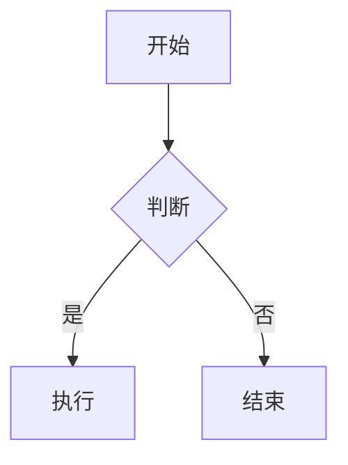

**user**: md基本格式是什么来着
[Context: Notes: 数据结构.md]
[Timestamp: 2026/01/05 13:25:31]

**ai**: 
<think>嗯，用户正在编辑一个名为“数据结构”的Obsidian笔记，但当前笔记内容是空的。用户突然问起了Markdown的基本格式，看起来是在编辑过程中需要快速参考语法。

用户的问题很简单直接，就是询问Markdown的基本格式。考虑到用户正在使用Obsidian，我应该提供Obsidian环境中常用的Markdown语法，而不仅仅是通用Markdown。这样能确保用户看到的内容能直接在当前笔记中应用。

我需要在回复中涵盖最常用的几个元素：标题、加粗/斜体、列表、链接、图片、代码块、表格和分割线。这些是用户在编辑笔记时最可能用到的功能。每个都要给出清晰的示例，让用户能直接复制使用。

由于用户之前有笔记相关的对话历史，但当前问题不涉及具体笔记内容，我只需专注于语法参考。回复结构可以按功能分类，用简洁的示例展示写法。开头加个简要说明，让用户知道这些是Obsidian可用的格式。

好，现在可以开始组织具体内容了。先说明这是Obsidian可用的语法，然后按标题、强调文本、列表等顺序逐一说明，最后留个开放结尾方便用户进一步询问。</think>在 Obsidian 中常用的 Markdown 基本格式如下：

## 标题
```
# 一级标题
## 二级标题
### 三级标题
```

## 强调文本
```
**加粗文本**
*斜体文本*
***粗斜体文本***
~~删除线文本==高亮文本==
```

## 列表
- 无序列表：`- 项目` 或 `* 项目`（Obsidian 推荐用 `-`）
- 有序列表：`1. 项目`
- 任务列表：`- [ ] 未完成` 和 `- [x] 完成`

## 链接
- 内部链接：`[[笔记名]]` 或 `[[笔记名|显示文字]]`
- 外部链接：`[显示文字](https://example.com)`

## 图片
- 本地图片：`![[图片名.png]]`
- 网络图片：``

## 代码
- 行内代码：`` `代码` ``
- 代码块：
````
```语言
多行代码
```
````

## 表格
```
| 标题1 | 标题2 |
|-------|-------|
| 内容1 | 内容2 |
```

## 分割线
```
---
```

## 引用
```
> 引用内容
```

## 脚注
```
正文内容[^1]

[^1]: 脚注说明
```

## LaTeX 数学公式
- 行内公式：`$E=mc^2$`
- 块公式：
```
$$
\sum_{i=1}^n i = \frac{n(n+1)}{2}
$$
```

这些都是 Obsidian 中常用的 Markdown 格式，你可以直接在 [[数据结构]] 笔记中试用。
[Timestamp: 2026/01/05 13:25:53]

**user**: 可是#不是标题嘛
[Context: Notes: 数据结构.md]
[Timestamp: 2026/01/05 13:26:49]

**ai**: 
<think>用户的问题是“可是#不是标题嘛”，这看起来是在对我之前回复中“#栈”的用法表示疑问。用户可能看到了“数据结构.md”笔记中的“#栈”内容，并认为它应该被识别为标题，但可能在实际显示中遇到了问题。

回顾一下，我之前提供的Markdown基本格式中明确说明了“# 一级标题”的用法。用户现在提出这个问题，可能是想确认“#栈”这样的写法是否正确，或者在实际使用中遇到了标题没有正确渲染的情况。

我需要解释一下Markdown标题的语法规则：井号(#)后面必须跟一个空格，然后才是标题文字。如果写成“#栈”没有空格，大多数Markdown解析器不会将其识别为标题。

同时，我也注意到用户正在编辑的“数据结构.md”笔记当前是空白的，但上下文库中显示它包含“#栈”的内容。这可能意味着用户之前添加了内容但当前编辑视图是空的，或者用户在其他地方看到了这个语法。

我应该：
1. 明确解释标题语法的正确格式
2. 指出“#栈”缺少空格的问题
3. 提供正确的示例
4. 询问用户是否遇到了具体的渲染问题

这样既能解答用户的疑问，又能提供实用的帮助。</think>您说得对！`#` 确实是 Markdown 中表示标题的符号。

不过在 Markdown 语法中，**井号(#)后面必须跟一个空格**，然后才是标题文字。例如：

✅ 正确：`# 栈` → 会显示为一级标题
❌ 不正确：`#栈` → 可能不会被识别为标题，只是普通文本

在您看到的 [[数据结构]] 笔记中，有“#栈”这样的内容，它缺少了必要的空格，所以可能没有正确显示为标题。

正确的写法应该是：
```
# 栈
```

这样就会显示为：
# 栈

您是在编辑笔记时发现标题没有正确显示吗？如果是的话，检查一下井号和标题文字之间是否有空格就可以了。
[Timestamp: 2026/01/05 13:27:03]

**user**: 怎么在obsidian里面插入pdf
[Context: Notes: 数据结构.md]
[Timestamp: 2026/01/05 13:29:45]

**ai**: 
<think>Okay, the user is asking how to insert a PDF in Obsidian. This is a specific technical question about the note-taking app. I need to provide clear, step-by-step instructions since the user might not be familiar with the process. 

I recall that Obsidian supports embedding various file types, including PDFs, as internal or external links. The key methods are embedding the entire PDF or linking to it. I should mention both options and explain the difference. 

For embedding, the syntax is similar to images but with the PDF file extension. For linking, it's the standard Markdown link syntax. I should also note that the PDF needs to be in the vault or accessible via a path. 

It might help to provide examples for each method so the user can see the exact format. I’ll keep it concise but cover the essentials.</think>在 Obsidian 中插入 PDF 有以下几种常用方法：

## 1. 嵌入显示整个 PDF 文件（推荐）
使用以下语法将 PDF 直接嵌入到笔记中查看：
```
![[文件名.pdf]]
```
- 将 `文件名.pdf` 替换为你的 PDF 文件实际名称
- PDF 文件需要放在 Obsidian 仓库（vault）内
- 在阅读视图下可以直接浏览 PDF 内容

## 2. 创建 PDF 链接
如果不想嵌入显示，可以创建可点击的链接：
```
[[文件名.pdf]]
```
或
```
[自定义链接文字](文件名.pdf)
```

## 操作步骤：
1. **将 PDF 文件复制到你的 Obsidian 仓库文件夹中**
   - 可以直接拖拽到 Obsidian 文件管理区域
   
2. **在笔记中使用上述语法引用**
   - 输入 `![[` 后，Obsidian 会提示你选择文件
   
3. **调整显示大小（可选）**
   ```
   ![[文件名.pdf|300]]  # 设置宽度为300像素
   ```

## 示例：
假设你有一个 `用户手册.pdf` 文件：
- 嵌入：`![[用户手册.pdf]]`
- 链接：`[[用户手册.pdf]]` 或 `[点击查看手册](用户手册.pdf)`

## 注意事项：
- PDF 文件较大时，嵌入可能会影响笔记加载速度
- 移动端 Obsidian 对 PDF 的支持可能有限
- 确保 PDF 文件名不包含特殊字符

你现在可以尝试将 PDF 拖入 Obsidian 左侧文件列表，然后在笔记中引用它。
[Timestamp: 2026/01/05 13:30:03]

**user**: 我能用上面插件
[Context: Notes: 数据结构.md]
[Timestamp: 2026/01/05 13:30:25]

**ai**: 
<think>用户问“我能用上面插件”，结合之前的对话历史，我们刚才在讨论如何在Obsidian中插入PDF。用户可能是在问能否使用某个插件来插入PDF，或者更广泛地问能否用插件来辅助操作。

从上下文看，我们之前没有提到具体的插件名称。Obsidian本身有社区插件市场，里面有很多插件可以增强PDF功能，比如增强PDF嵌入、标注等。用户可能听说过某些插件，或者想了解是否有插件可以更方便地插入PDF。

我应该先澄清：Obsidian本身支持嵌入PDF（如之前所述），但社区插件可以提供更多功能。然后列举一些常用的PDF相关插件，并说明如何安装。最后询问用户具体想实现什么功能，以便给出更精准的建议。</think>您提到的“上面插件”具体是指哪个呢？从我们之前的对话来看，我并没有推荐特定的插件名称。

不过，如果您想在 Obsidian 中更好地处理 PDF，确实有一些很实用的社区插件：

## 常用 PDF 相关插件：
1. **Enhanced PDF** - 增强 PDF 查看和标注功能
2. **Annotator** - 支持在 PDF 上做笔记和标注
3. **PDF++** - 提供更多 PDF 显示和操作选项

## 安装插件步骤：
1. 打开 Obsidian 设置 → 第三方插件
2. 关闭“安全模式”
3. 点击“浏览”进入社区插件市场
4. 搜索插件名称并安装
5. 启用插件并可能需要重启

## 您具体想实现什么功能呢？
- 更好的 PDF 阅读体验？
- PDF 内标注和高亮？
- 提取 PDF 文字内容？
- 其他特定需求？

告诉我您的具体需求，我可以推荐更合适的插件或方法。Obsidian 的社区插件非常丰富，几乎能满足各种需求。
[Timestamp: 2026/01/05 13:30:38]

**user**: 怎么把文本不显示，类似于编程语言里面的/* */
[Context: Notes: 数据结构.md]
[Timestamp: 2026/01/05 14:41:15]

**ai**: 
<think>Okay, the user is asking how to hide or comment out text in Obsidian, similar to /* */ in programming languages. They mentioned the "数据结构.md" file in the context, but that's just a note from their vault with a table of contents for data structures. The actual query is about formatting in Obsidian.

The user wants to know how to make text not display, like comments in code. In Obsidian, which uses Markdown, there are a few ways to do this. I should explain the options clearly.

First, the standard Markdown way is using HTML comments, which are hidden in reading view. That's probably the closest to /* */. Also, Obsidian has callouts which can be collapsed, but that's more for hiding content interactively. Alternatively, they could use %% for inline comments, which is an Obsidian-specific feature.

I should mention that HTML comments are the most straightforward for hiding blocks of text. I'll give examples for each method and recommend the HTML one since it's universal and simple. The user might not be aware of these options, so I'll keep it practical with syntax examples.</think>在 Obsidian 中，有几种方法可以实现类似编程语言中 `/* */` 的注释效果，将文本隐藏不显示：

## 1. **HTML 注释（最常用）**
```html
<!-- 这部分内容在阅读视图和预览中都不会显示 -->
```
- 支持多行注释
- 在源码模式可见，阅读/预览模式隐藏
- 兼容性好，是标准 Markdown/HTML 方式

## 2. **Obsidian 注释语法**
```markdown
%% 单行注释 %%

%% 
多行
注释
%%
```
- Obsidian 特有语法
- 同样在预览时隐藏

## 3. **折叠块（部分隐藏）**
````markdown
<details>
<summary>点击展开隐藏内容</summary>

这里是隐藏的内容
只有点击才会显示

</details>
````

## 示例对比：
```markdown
正常显示的文本

<!-- 这是隐藏的注释
可以写多行
都不会显示 -->

%% 这也是注释 %%

更多正常内容
```

## 使用建议：
- 如果只是临时隐藏内容，用 `<!-- -->` 最方便
- 如果是永久性注释或说明，用 `%%` 也可以
- 折叠块适合想要“按需显示”的内容

在你的 [[数据结构]] 笔记中，可以用这些方法来添加不显示的注释或说明。
[Timestamp: 2026/01/05 14:42:24]

**user**: md基本格式是什么来着，用例子来模板
[Context: Notes: dsacpp-3rd-edn.pdf]
[Timestamp: 2026/01/05 14:50:03]

**ai**: 
<think>好的，用户又问了同样的问题“md基本格式是什么来着，用例子来模板”，之前已经回答过Markdown基本格式，但这次用户特别要求用例子来展示模板。可能用户之前看了我的回答，但觉得不够直观，想要更具体的模板示例。

用户是Obsidian用户，正在编辑笔记，需要快速可复用的模板。深层需求可能是想直接复制粘贴到自己的笔记中，节省时间。

我需要提供结构清晰、带有实际例子的模板，让用户能直接套用。要覆盖最常用的元素：标题、强调、列表、链接、图片、代码、表格等，每个都给出完整例子。

考虑到用户之前对“#栈”的疑问，这次要特别强调标题语法的空格问题。同时，用户可能对Obsidian特有的功能感兴趣，比如内部链接、Mermaid图表等，可以适当提及。

回复结构可以按功能分块，每个功能先给语法说明，再给渲染效果示例，这样最直观。最后提醒用户这些模板在Obsidian中可直接使用。</think>好的，这是 Markdown 基本语法的模板库，每个都包含“写法”和“效果”示例，你可以直接复制使用。

### 1. 标题
```
# 一级标题
## 二级标题
### 三级标题
```
**效果预览：**
# 一级标题
## 二级标题
### 三级标题
> **注意**：`#` 和标题文字之间**必须有空格**。

### 2. 文本强调
```
这是 **加粗文字**
这是 *斜体文字*
这是 ***粗斜体***
这是 ~~删除线~~
这是 `行内代码`
```
**效果预览：**
这是 **加粗文字**  
这是 *斜体文字*  
这是 ***粗斜体***  
这是 ~~删除线~~  
这是 `行内代码`

### 3. 列表
#### 无序列表
```
- 项目一
- 项目二
  - 子项目（缩进两个空格）
```
**效果预览：**
- 项目一
- 项目二
  - 子项目

#### 有序列表
```
1. 第一件事
2. 第二件事
   1. 子步骤
```
**效果预览：**
1. 第一件事
2. 第二件事
   1. 子步骤

#### 任务列表
```
- [ ] 未完成的任务
- [x] 已完成的任务
```
**效果预览：**
- [ ] 未完成的任务
- [x] 已完成的任务

### 4. 链接与图片
#### 链接
```
[这是一个外部链接](https://www.example.com)
[[这是一个内部笔记链接]]
[[内部笔记|自定义显示文字]]
```
#### 图片
```

![[仓库内的图片.png]]
```

### 5. 代码块
<pre>
```python
def hello():
    print("这是一个代码块")
    return True
```
</pre>
**效果预览：**
```python
def hello():
    print("这是一个代码块")
    return True
```

### 6. 表格
```
| 姓名 | 年龄 | 职业 |
|------|------|------|
| 张三 | 28   | 工程师 |
| 李四 | 32   | 设计师 |
```
**效果预览：**
| 姓名 | 年龄 | 职业 |
|------|------|------|
| 张三 | 28   | 工程师 |
| 李四 | 32   | 设计师 |

### 7. 引用与分割线
```
> 这是一段引用文字。
> 可以有多行。
---
> 引用下方用分割线隔开。
```
**效果预览：**
> 这是一段引用文字。
> 可以有多行。
---
> 引用下方用分割线隔开。

### 8. 隐藏注释（你之前问到的）
```
<!-- 这是一个隐藏的注释，预览时看不到 -->
正常内容 <!-- 行内注释 -->
```
**效果预览：** （注释部分不会显示）
正常内容

### 9. Obsidian 特色功能模板
#### 双链与嵌入
```
链接到笔记：[[数据结构]]
嵌入笔记内容：![[待办事项]]
嵌入笔记的某个标题：![[数据结构#查找]]
```
#### Mermaid 图表
<pre>

</pre>

你可以将上述任何模块复制到你的笔记（如 [[数据结构]]）中直接使用或修改。需要哪个部分的详细例子，可以随时问我。
[Timestamp: 2026/01/05 14:50:41]

**user**: 代码块怎么写
[Context: Notes: 数据结构.md]
[Timestamp: 2026/01/05 14:55:30]

**ai**: 
<think>嗯，用户问的是“代码块怎么写”，结合之前的对话历史，用户正在学习Markdown的基本格式，并且特别要求用例子来展示模板。现在用户具体询问代码块的写法，这说明用户可能对代码块的使用有实际需求，或者在编辑笔记时需要插入代码示例。

从之前的回复中，我已经提供了代码块的模板，但用户可能还需要更详细的说明或者不同的语言示例。用户提到“用例子来模板”，所以这次回复应该继续保持提供具体可复制的模板风格。

我需要解释清楚代码块的基本语法，包括如何指定编程语言以获得语法高亮，还要提醒用户注意反引号的数量和位置。可以举几个不同语言的例子，比如Python、JavaScript、bash等，这样用户能直观看到效果。

另外，考虑到用户在使用Obsidian，可以补充一下Obsidian中代码块的一些特性，比如是否支持行号、代码折叠等高级功能。不过核心还是先让用户掌握基本写法。

用户可能正在编辑与技术相关的笔记，比如之前的“数据结构.md”文件，所以代码块的示例最好选择与数据结构相关的代码片段，这样更贴近用户的实际使用场景。</think>在 Markdown 中编写代码块的写法如下：

## 基本语法
<pre>
```语言名称
你的代码
```
</pre>

## 常用示例

### 1. Python 代码块
<pre>
```python
def quick_sort(arr):
    if len(arr) <= 1:
        return arr
    pivot = arr[len(arr)//2]
    left = [x for x in arr if x < pivot]
    middle = [x for x in arr if x == pivot]
    right = [x for x in arr if x > pivot]
    return quick_sort(left) + middle + quick_sort(right)
```
</pre>

**效果：**
```python
def quick_sort(arr):
    if len(arr) <= 1:
        return arr
    pivot = arr[len(arr)//2]
    left = [x for x in arr if x < pivot]
    middle = [x for x in arr if x == pivot]
    right = [x for x in arr if x > pivot]
    return quick_sort(left) + middle + quick_sort(right)
```

### 2. JavaScript 代码块
<pre>
```javascript
function binarySearch(arr, target) {
    let left = 0;
    let right = arr.length - 1;
    
    while (left <= right) {
        const mid = Math.floor((left + right) / 2);
        if (arr[mid] === target) return mid;
        if (arr[mid] < target) left = mid + 1;
        else right = mid - 1;
    }
    return -1;
}
```
</pre>

### 3. 无语法高亮（纯文本）
<pre>
```
这是纯文本代码块
没有语法高亮
适合显示日志或配置文件
```
</pre>

### 4. 行内代码（单行）
`` `单行代码` ``
**效果：** `printf("Hello World");`

## Obsidian 中的特殊用法

### 5. 显示行号
<pre>
```python {.line-numbers}
def factorial(n):
    if n == 0:
        return 1
    return n * factorial(n-1)
```
</pre>

### 6. 代码折叠
<pre>
<details>
<summary>点击展开代码</summary>

```c
#include <stdio.h>
int main() {
    printf("Hello, World!");
    return 0;
}
```
</details>
</pre>

## 快速记忆技巧
1. **三个反引号**：开头和结尾都是三个反引号
2. **语言标识**：开头的反引号后写上语言名称
3. **独立成块**：代码块前后要有空行（Obsidian 通常会自动处理）

## 在你笔记中的使用建议
在你的 [[数据结构]] 笔记中，可以这样使用：
```python
# 排序算法示例
def bubble_sort(arr):
    n = len(arr)
    for i in range(n):
        for j in range(0, n-i-1):
            if arr[j] > arr[j+1]:
                arr[j], arr[j+1] = arr[j+1], arr[j]
    return arr
```

需要哪种语言的代码块示例，或者有其他格式需求吗？
[Timestamp: 2026/01/05 14:56:03]

**user**: 语言种类怎么填
[Context: Notes: 数据结构.md]
[Timestamp: 2026/01/05 14:59:10]

**ai**: 
<think>用户的问题是关于代码块中“语言种类怎么填”，这指的是在Markdown代码块开头的三个反引号后面指定的语言标识。我需要解释如何填写这个语言名称，并提供一些常见的例子。

首先，用户可能对编程语言的名称不太熟悉，或者不确定应该使用什么关键词。我需要列出一些常用的语言标识，并说明它们通常是小写的，并且是通用的语言名称。

其次，考虑到用户正在使用Obsidian，我可以提及Obsidian支持的语言高亮范围，但不需要深入细节。重要的是让用户知道，正确的语言标识可以触发语法高亮，如果写错了或者不写，就只是普通文本。

另外，用户可能看到过一些复杂的代码块，比如带有行号或特定主题的，但当前问题只关注语言种类，所以我应该保持回答聚焦在这一点上。

最后，我应该给出一个简单的总结，让用户知道如何查找更多语言标识，并鼓励他们尝试。</think>在 Markdown 代码块中，语言种类填写的是**编程语言的名称或标识符**，用于触发正确的语法高亮。

## 常见语言种类写法
| 语言 | 写法 |
|------|------|
| Python | `python` |
| JavaScript | `javascript` 或 `js` |
| Java | `java` |
| C | `c` |
| C++ | `cpp` 或 `c++` |
| HTML | `html` |
| CSS | `css` |
| SQL | `sql` |
| Bash/Shell | `bash` 或 `sh` |
| Markdown | `markdown` |
| 纯文本（无高亮） | 不填或填 `text` |

## 具体示例
### 正确写法
````
```python
print("Hello World")
```

```javascript
console.log("Hello World")
```

```html
<div>Hello World</div>
```
````

### 错误写法
````
```Python```   （首字母不应大写）
```JAVA```      （不应全大写）
```python3```   （通常只用 `python` 即可）
````

## 使用建议
1. **小写为主**：大多数语言标识使用小写字母
2. **通用名称**：用通用的语言名称，如 `js` 而不是 `javascript es6`
3. **不确定时**：可不填语言种类，代码块将以纯文本显示
4. **Obsidian 支持**：Obsidian 支持所有常见编程语言的语法高亮

## 在 [[数据结构]] 笔记中的应用
```c
// 使用 'c' 作为 C 语言代码块
#include <stdio.h>

int main() {
    printf("数据结构示例");
    return 0;
}
```

```python
# 使用 'python' 作为 Python 代码块
class TreeNode:
    def __init__(self, val=0, left=None, right=None):
        self.val = val
        self.left = left
        self.right = right
```

**简单记忆**：填写你代码的实际编程语言名称（小写），Obsidian 会自动匹配对应的语法高亮规则。
[Timestamp: 2026/01/05 15:00:20]

**user**: 代码折叠
[Context: Notes: 数据结构.md]
[Timestamp: 2026/01/05 15:46:15]

**ai**: 
<think>用户问的是“代码折叠”，这是在Markdown或Obsidian中常用的功能，用于隐藏或展开代码块，使笔记更整洁。用户可能希望知道如何在Obsidian中实现代码折叠。

根据之前对话，用户正在编辑“数据结构.md”笔记，并且之前讨论过代码块的写法。代码折叠通常可以通过HTML的details标签实现，或者Obsidian的一些插件或原生支持。

我需要提供几种方法：
1. 使用HTML的details和summary标签（通用Markdown方法）
2. Obsidian可能的原生支持或插件
3. 举例说明，特别是针对用户笔记中的代码块

由于用户之前提到过代码块，可以结合之前的内容给出示例。另外，用户可能希望折叠大段代码，比如在数据结构笔记中的算法示例。</think>在 Obsidian 中实现代码折叠有以下几种方法：

## 1. **HTML Details 标签（通用方法）**
```html
<details>
<summary>点击展开/折叠代码</summary>

```python
def example():
    print("这里是可折叠的代码")
    return True
```

</details>
```

**效果：**
<details>
<summary>点击展开/折叠代码</summary>

```python
def example():
    print("这里是可折叠的代码")
    return True
```

</details>

## 2. **Obsidian 原生代码折叠**
Obsidian 默认支持代码块的折叠，但需要手动开启：
1. 打开 Obsidian 设置 → 编辑器
2. 启用 **"折叠缩进"** 或 **"折叠标题"**
3. 在代码块左侧会出现折叠箭头

## 3. **使用 Callouts 实现折叠**
````markdown
> [!note]- 算法实现（点击展开）
> ```c
> // 快速排序算法
> void quickSort(int arr[], int low, int high) {
>     if (low < high) {
>         int pi = partition(arr, low, high);
>         quickSort(arr, low, pi - 1);
>         quickSort(arr, pi + 1, high);
>     }
> }
> ```
````

**效果：**
> [!note]- 算法实现（点击展开）
> ```c
> // 快速排序算法
> void quickSort(int arr[], int low, int high) {
>     if (low < high) {
>         int pi = partition(arr, low, high);
>         quickSort(arr, low, pi - 1);
>         quickSort(arr, pi + 1, high);
>     }
> }
> ```

## 4. **插件增强**
- **Collapse All**：一键折叠所有代码块
- **Better Codeblock**：增强代码块功能，包括更好的折叠控制

## 在 [[数据结构]] 笔记中的应用示例
<details>
<summary>栈的顺序存储实现（C语言）</summary>

```c
#define STACK_INIT_SIZE 100
typedef struct {
    SElemType *base;
    SElemType *top;
    int stacksize;
} SqStack;

Status InitStack(SqStack &S) {
    S.base = (SElemType*)malloc(STACK_INIT_SIZE * sizeof(SElemType));
    if (!S.base) exit(OVERFLOW);
    S.top = S.base;
    S.stacksize = STACK_INIT_SIZE;
    return OK;
}
```
</details>

## 使用建议
1. **HTML Details 标签**最灵活，可以自定义标题
2. **Obsidian 原生折叠**最方便，但只能折叠整个代码块
3. **Callouts** 样式美观，适合做说明性折叠

你可以根据需要在笔记中选择合适的方法。通常对于较长的代码示例，使用折叠功能可以让笔记更整洁易读。
[Timestamp: 2026/01/05 15:46:45]